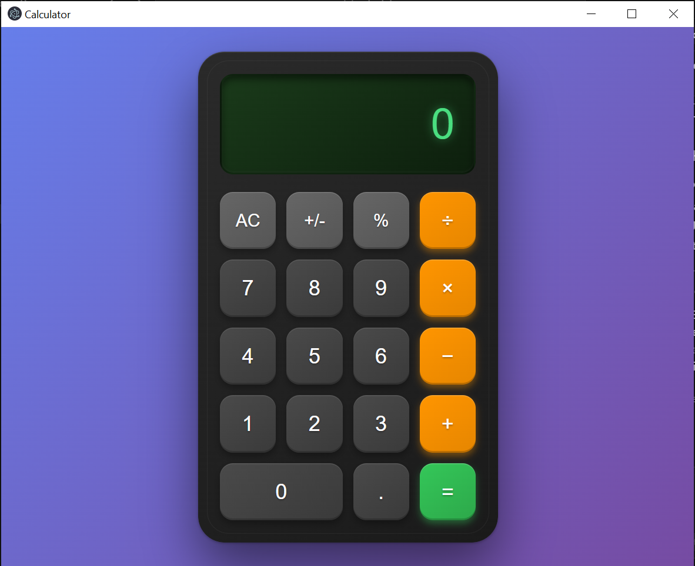

# Electron Calculator

A beautiful, modern calculator application built with Electron, featuring a sleek dark theme with gradient backgrounds and smooth animations.

## Features

- **Clean Interface**: Modern dark theme with gradient backgrounds
- **Full Calculator Functionality**: 
  - Basic arithmetic operations (+, −, ×, ÷)
  - Decimal number support
  - Percentage calculations
  - Sign toggle (+/-)
  - Clear all (AC)
- **Responsive Design**: Smooth button animations and hover effects
- **Cross-Platform**: Runs on Windows, macOS, and Linux
- **Frameless Window**: Clean, borderless interface with hidden menu bar

## Screenshots


The calculator features:
- Dark gradient background with neon green display
- Smooth button press animations
- Modern typography and spacing
- Responsive grid layout for buttons

## Installation

1. **Clone or download** this repository
2. **Install dependencies**:
   ```bash
   npm install
   ```

## Running the Application

To start the calculator:

```bash
npm start
```

Or run directly with Electron:

```bash
npx electron .
```

## Project Structure

```
calculator/
├── index.html          # Main HTML structure
├── style.css          # Styling and animations
├── renderer.js        # Calculator logic and functionality
├── main.js           # Electron main process configuration
├── preload.js        # Preload script for security
├── package.json      # Project dependencies and scripts
└── README.md         # This file
```

## Technical Details

### Electron Configuration
- **Frameless Window**: Clean interface without OS window decorations
- **Hidden Menu Bar**: Menu bar auto-hides for distraction-free experience
- **Security**: Context isolation enabled with preload script
- **Window Size**: 800x600 pixels optimized for calculator layout

### Calculator Logic
The calculator handles:
- **Number Input**: Supports multi-digit numbers and decimals
- **Operations**: Basic arithmetic with proper operator precedence
- **Error Handling**: Division by zero protection
- **State Management**: Tracks current value, previous value, and operator

### Styling Features
- **CSS Grid Layout**: Responsive button arrangement
- **Gradient Backgrounds**: Modern visual appeal
- **Box Shadows**: Depth and dimension effects
- **Smooth Transitions**: Button press and hover animations
- **Color Coding**: Different button types have distinct colors

## Development

### Dependencies
- **electron**: ^28.0.0 - Cross-platform desktop app framework

### Scripts
- `npm start`: Launch the Electron application
- `npm test`: Run any available tests

## Customization

### Changing Window Properties
Edit `main.js` to modify:
- Window size (width, height)
- Frame visibility (frame: true/false)
- Menu bar behavior (autoHideMenuBar: true/false)

### Styling
Modify `style.css` to customize:
- Color schemes and gradients
- Button sizes and spacing
- Animations and transitions
- Typography and fonts

### Functionality
Extend `renderer.js` to add:
- Additional mathematical operations
- Memory functions
- History tracking
- Keyboard shortcuts

## Building for Distribution

To create distributable packages:

```bash
# Install electron-builder (if not already installed)
npm install --save-dev electron-builder

# Build for current platform
npm run build

# Build for all platforms
npm run build:all
```

## Keyboard Support

The calculator can be extended to support keyboard input by adding event listeners in `renderer.js` for:
- Number keys (0-9)
- Operation keys (+, -, *, /)
- Enter key (=)
- Escape key (AC)
- Decimal point (.)

## Browser Compatibility

While designed for Electron, the calculator can also run in modern web browsers by opening `index.html` directly.

## Contributing

Feel free to contribute by:
1. Adding new mathematical functions
2. Improving the UI/UX
3. Adding keyboard shortcuts
4. Implementing memory functions
5. Adding themes or customization options

## License

This project is open source and available under the [MIT License](LICENSE).

## Acknowledgments

Built with [Electron](https://www.electronjs.org/) - the framework for building cross-platform desktop apps with web technologies.
